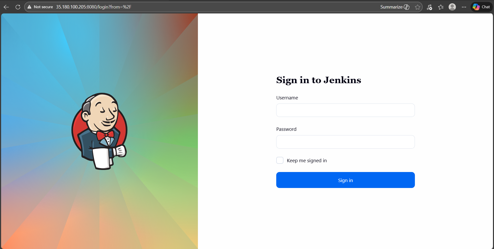
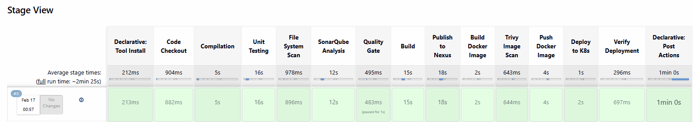
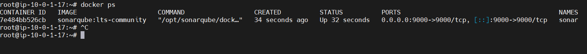
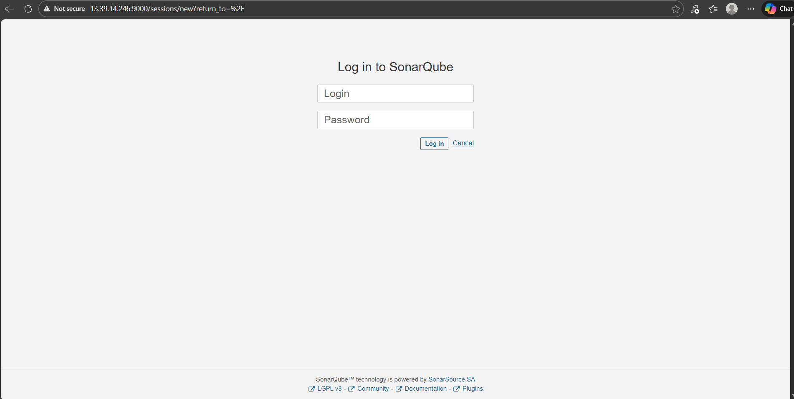
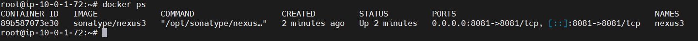
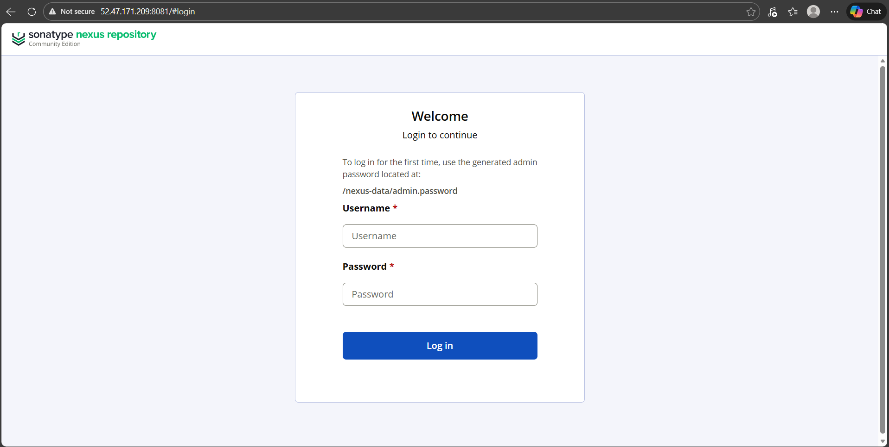
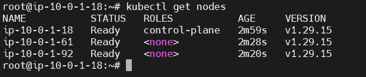

# 🚀 Enterprise DevSecOps CI/CD Pipeline on Kubernetes

End-to-end **enterprise CI/CD pipeline** implementing modern **DevSecOps practices** using Jenkins, SonarQube, Nexus, Docker, Trivy, and Kubernetes.

This project simulates a **production-style software delivery workflow** from source code commit to automated Kubernetes deployment with integrated security, quality control, and artifact management.

---

# 📌 Project Highlights

- End-to-End CI/CD automation
- DevSecOps security scanning
- Artifact repository integration
- Containerized deployment
- Kubernetes Continuous Delivery
- RBAC-secured cluster deployment
- Automated deployment verification

---

# 🏗️ Architecture Overview

```
Developer
   |
   v
 GitHub
   |
   v
 Jenkins Pipeline
   |
   |---- Build & Test (Maven)
   |---- Trivy Filesystem Scan
   |---- SonarQube Code Analysis
   |---- Quality Gate
   |
   v
 Nexus Artifact Repository
   |
   v
 Docker Build
   |
   v
 Trivy Image Scan
   |
   v
 Docker Hub
   |
   v
 Kubernetes Cluster (kubeadm)
   |
   |---- Deployment
   |---- Service
   |
   v
 Deployment Verification
```

---

# 🧠 Methodology Applied

This pipeline was designed following **enterprise DevSecOps methodology**.

### Continuous Integration
Automated build and testing triggered from GitHub source repository.

### Security Integration
Security scanning implemented early in the pipeline:

- Filesystem vulnerability scanning
- Container image vulnerability scanning
- Static code analysis

### Quality Gate Enforcement
SonarQube quality gates ensure builds only proceed if code quality standards are met.

### Artifact Management
Artifacts stored in **Nexus Repository Manager** enabling centralized version control.

### Containerization
Applications packaged into Docker images for consistent runtime environments.

### Continuous Deployment
Images automatically deployed to a **self-managed Kubernetes cluster**.

---

# ☸️ Kubernetes Cluster (kubeadm)

The Kubernetes cluster was provisioned using **kubeadm**.

### Cluster Topology

| Node | Role |
|-----|------|
Master Node | Control Plane |
Worker Node | Application Workloads |
Worker Node | Application Workloads |

### Networking

Calico CNI

### Components Installed

- containerd runtime
- kubeadm
- kubelet
- kubectl

Deployment is performed directly from Jenkins using **kubectl**.

---

# 🔐 RBAC Secure Deployment

To enable secure Jenkins deployment to Kubernetes, RBAC was implemented.

### ServiceAccount

```yaml
apiVersion: v1
kind: ServiceAccount
metadata:
  name: jenkins
  namespace: project
```

### Role

Permissions granted for deployment resources including:

- Pods
- Deployments
- Services
- ConfigMaps
- Secrets

### RoleBinding

Jenkins pipeline authenticates using a **ServiceAccount token**.

This ensures:

- secure deployment access
- namespace isolation
- least privilege security model

---

# ⚙️ Jenkins CI/CD Pipeline

The Jenkins pipeline orchestrates the full software delivery lifecycle.

### Pipeline Stages

1. Code Checkout
2. Compilation
3. Unit Testing
4. Filesystem Security Scan (Trivy)
5. SonarQube Code Analysis
6. Quality Gate Validation
7. Build Artifact
8. Publish Artifact to Nexus
9. Docker Image Build
10. Container Image Security Scan
11. Docker Image Push
12. Deploy to Kubernetes
13. Verify Deployment

---

# 🛡️ DevSecOps Integration

Security scanning is integrated directly in the pipeline.

### Filesystem Scan

```bash
trivy fs .
```

### Container Image Scan

```bash
trivy image <image>
```

These scans detect:

- OS vulnerabilities
- library vulnerabilities
- critical security issues

Reports are archived in Jenkins artifacts.

---

# 📦 Artifact Management (Nexus)

The pipeline publishes Maven artifacts to **Nexus Repository Manager**.

```bash
mvn deploy
```

Benefits:

- artifact versioning
- centralized storage
- reproducible builds

---

# 🐳 Docker Containerization

Application packaged as Docker image and pushed to Docker Hub.

```bash
docker build -t <image>:latest .
docker push <image>:latest
```

---

# 🚀 Kubernetes Deployment

Jenkins deploys the application using Kubernetes manifests.

```bash
kubectl apply -f deploy-svc.yaml
```

Verification stage checks:

```bash
kubectl get pods
kubectl get svc
kubectl get deployments
```

---

# 📊 Results

The pipeline now enables:

- automated CI/CD delivery
- integrated security scanning
- centralized artifact management
- containerized Kubernetes deployment
- RBAC-secured production workflow

---

# 🖼️ Screenshots

The following screenshots demonstrate the pipeline workflow and infrastructure components used in this project.

---

### Jenkins Login

Jenkins CI/CD server used to orchestrate the full DevSecOps pipeline.



---

### Jenkins Pipeline Execution

Successful pipeline run showing build, security scanning, artifact publishing, and Kubernetes deployment stages.



---

### SonarQube Container

SonarQube running as a container used for static code analysis and quality gate validation.



---

### SonarQube Dashboard

Code quality dashboard showing analysis results and quality gate status.



---

### Nexus Container

Nexus Repository Manager container used for artifact storage and dependency management.



---

### Nexus Repository Dashboard

Nexus web interface displaying artifact repositories and stored build artifacts.



---

### Kubernetes Cluster Nodes

Kubernetes cluster nodes showing the control plane and worker nodes used for application deployment.




# 🧰 Technology Stack

- Jenkins
- Kubernetes
- Docker
- SonarQube
- Nexus
- Trivy
- Maven
- GitHub
- Linux
- DevSecOps

---

# 📎 Repository

https://github.com/Mahmoud-Khalil25

---

# 👨‍💻 Author

**Mahmoud Khalil**  
DevOps Engineer

---

# ⭐ Purpose

This project demonstrates practical implementation of **enterprise DevOps practices**, combining CI/CD automation, security integration, containerization, and Kubernetes deployment in a realistic production workflow.
